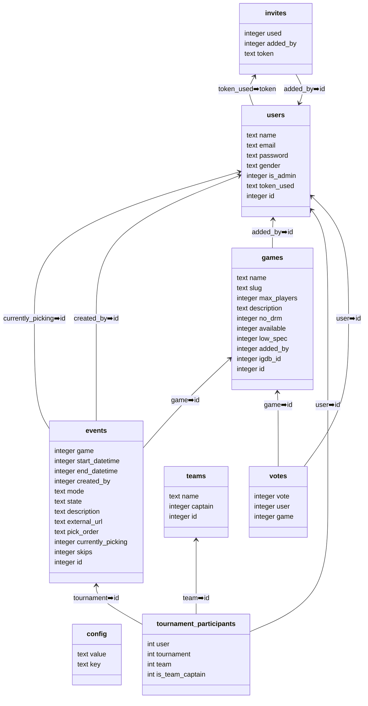

```mermaid
classDiagram
direction BT
class config {
   text value
   text key
}
class events {
   integer game
   integer start_datetime
   integer end_datetime
   integer created_by
   text mode
   text state
   text description
   text external_url
   text pick_order
   integer currently_picking
   integer skips
   integer id
}
class games {
   text name
   text slug
   integer max_players
   text description
   integer no_drm
   integer available
   integer low_spec
   integer added_by
   integer igdb_id
   integer id
}
class invites {
   integer used
   integer added_by
   text token
}
class teams {
   text name
   integer captain
   integer id
}
class tournament_participants {
   int user
   int tournament
   int team
   int is_team_captain
}
class users {
   text name
   text email
   text password
   text gender
   integer is_admin
   text token_used
   integer id
}
class votes {
   integer vote
   integer user
   integer game
}

events  -->  games : game➡️id
events  -->  users : currently_picking➡️id
events  -->  users : created_by➡️id
games  -->  users : added_by➡️id
invites  -->  users : added_by➡️id
tournament_participants  -->  events : tournament➡️id
tournament_participants  -->  teams : team➡️id
tournament_participants  -->  users : user➡️id
users  -->  invites : token_used➡️token
votes  -->  games : game➡️id
votes  -->  users : user➡️id
```