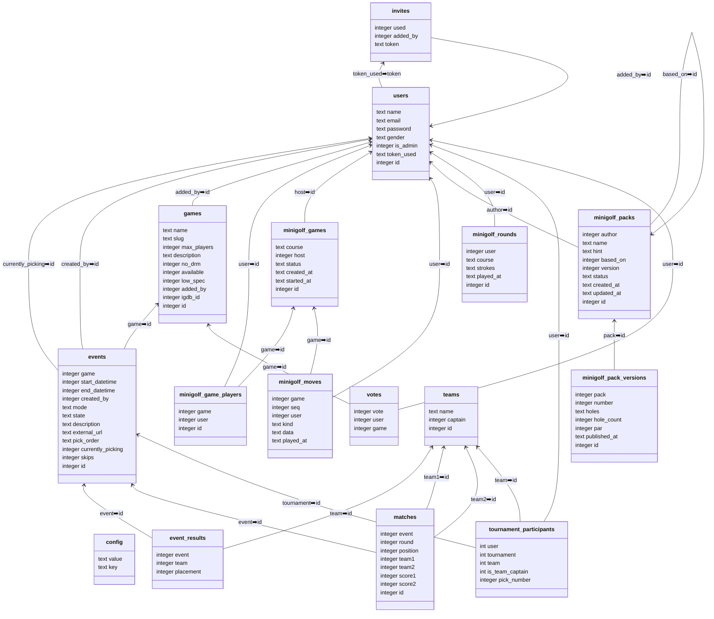

```mermaid
classDiagram
direction BT
class config {
   text value
   text key
}
class event_results {
   integer event
   integer team
   integer placement
}
class events {
   integer game
   integer start_datetime
   integer end_datetime
   integer created_by
   text mode
   text state
   text description
   text external_url
   text pick_order
   integer currently_picking
   integer skips
   integer id
}
class games {
   text name
   text slug
   integer max_players
   text description
   integer no_drm
   integer available
   integer low_spec
   integer added_by
   integer igdb_id
   integer id
}
class invites {
   integer used
   integer added_by
   text token
}
class matches {
   integer event
   integer round
   integer position
   integer team1
   integer team2
   integer score1
   integer score2
   integer id
}
class minigolf_game_players {
   integer game
   integer user
   integer id
}
class minigolf_games {
   text course
   integer host
   text status
   text created_at
   text started_at
   integer id
}
class minigolf_moves {
   integer game
   integer seq
   integer user
   text kind
   text data
   text played_at
}
class minigolf_pack_versions {
   integer pack
   integer number
   text holes
   integer hole_count
   integer par
   text published_at
   integer id
}
class minigolf_packs {
   integer author
   text name
   text hint
   integer based_on
   integer version
   text status
   text created_at
   text updated_at
   integer id
}
class minigolf_rounds {
   integer user
   text course
   text strokes
   text played_at
   integer id
}
class teams {
   text name
   integer captain
   integer id
}
class tournament_participants {
   int user
   int tournament
   int team
   int is_team_captain
   integer pick_number
}
class users {
   text name
   text email
   text password
   text gender
   integer is_admin
   text token_used
   integer id
}
class votes {
   integer vote
   integer user
   integer game
}

event_results  -->  events : event➡️id
event_results  -->  teams : team➡️id
events  -->  games : game➡️id
events  -->  users : currently_picking➡️id
events  -->  users : created_by➡️id
games  -->  users : added_by➡️id
invites  -->  users : added_by➡️id
matches  -->  events : event➡️id
matches  -->  teams : team1➡️id
matches  -->  teams : team2➡️id
minigolf_game_players  -->  minigolf_games : game➡️id
minigolf_game_players  -->  users : user➡️id
minigolf_games  -->  users : host➡️id
minigolf_moves  -->  minigolf_games : game➡️id
minigolf_moves  -->  users : user➡️id
minigolf_pack_versions  -->  minigolf_packs : pack➡️id
minigolf_packs  -->  minigolf_packs : based_on➡️id
minigolf_packs  -->  users : author➡️id
minigolf_rounds  -->  users : user➡️id
tournament_participants  -->  events : tournament➡️id
tournament_participants  -->  teams : team➡️id
tournament_participants  -->  users : user➡️id
users  -->  invites : token_used➡️token
votes  -->  games : game➡️id
votes  -->  users : user➡️id
```